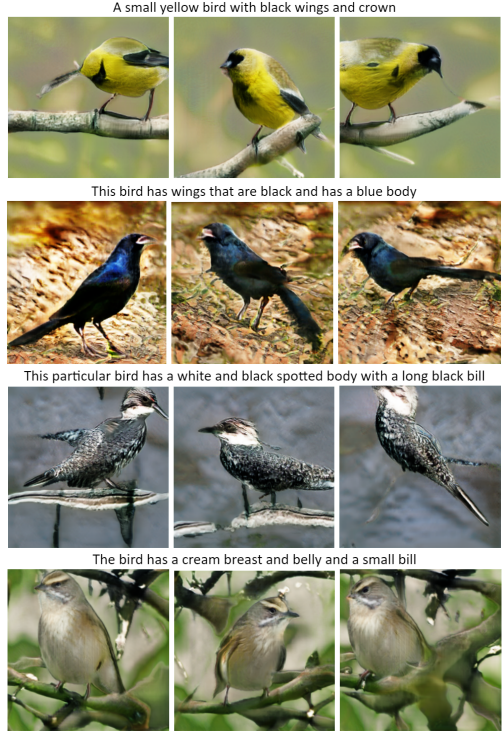
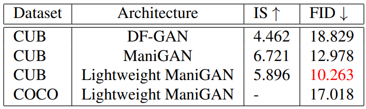

# Text-to-Image-GAN

GAN-based text-to-image generation models for the CUB and COCO datasets are experimented, and evaluated using the Inception Score (IS) and the Fréchet Inception Distance (FID) to compare output images across different architectures. The models are implemented in PyTorch 1.11.0.

##### Experimental setup
- Learning rate: 0.0002 for ManiGAN, Lightweight ManiGAN and 0.0001 for DF-GAN
- Optimizer: Adam
- Output image size: 256x256
- Epochs: 350

### Results
*Synthesized images*

*Experimental Results*

##### Our final weight files for trained models 
- [DF-GAN](https://drive.google.com/file/d/17iSeUJZVGyLwqkwKOCLtKOH76fNjRf5P/view?usp=sharing)
- [ManiGAN](https://drive.google.com/file/d/1qMNtmqAqFt2aNzWOY2CyK_MRtcjNCDvS/view?usp=sharing)
- [Lightweight ManiGAN](https://drive.google.com/file/d/1QhPx2GZmIUU17Nc6NY8e9jEATcM9ow1r/view?usp=sharing)
Download and save it to `models/` in order to get results

### References
[1] Deep Fusion GAN - [DF-GAN](https://arxiv.org/abs/2008.05865)

[2] Text-Guided Image Manipulation - [ManiGAN](https://arxiv.org/abs/1912.06203)

[3] Lightweight Architecture for Text-Guided Image Manipulation - [Lightweight ManiGAN](https://arxiv.org/abs/2010.12136)

[4] PyTorch Implementation for Inception Score (IS) - [IS](https://github.com/sbarratt/inception-score-pytorch) 

[5] PyTorch Implementation for Fréchet Inception Distance (FID) - [FID](https://github.com/mseitzer/pytorch-fid) 
